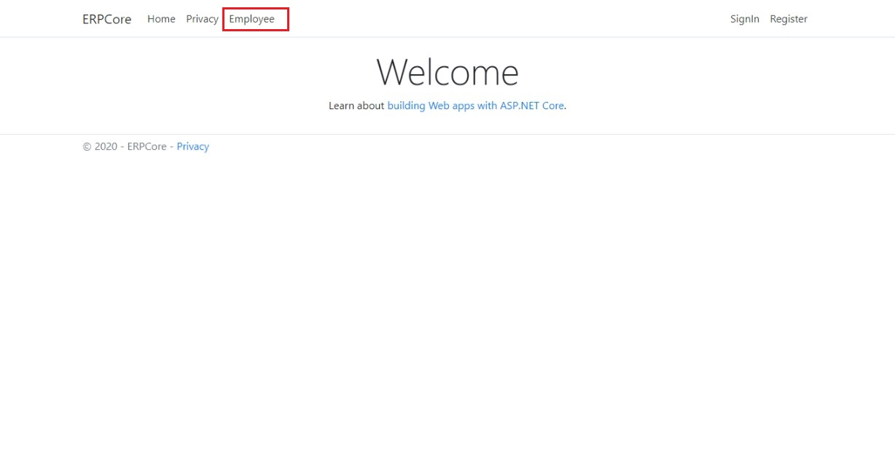
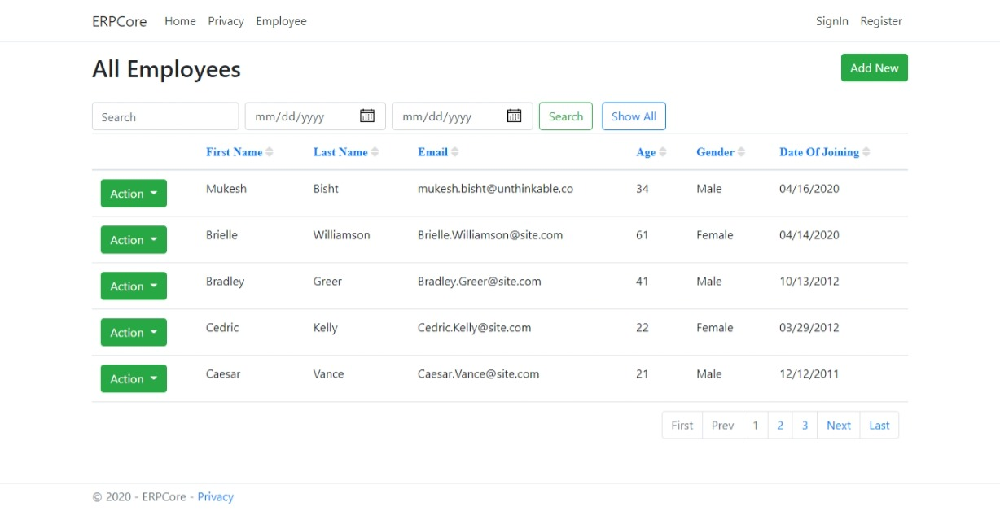
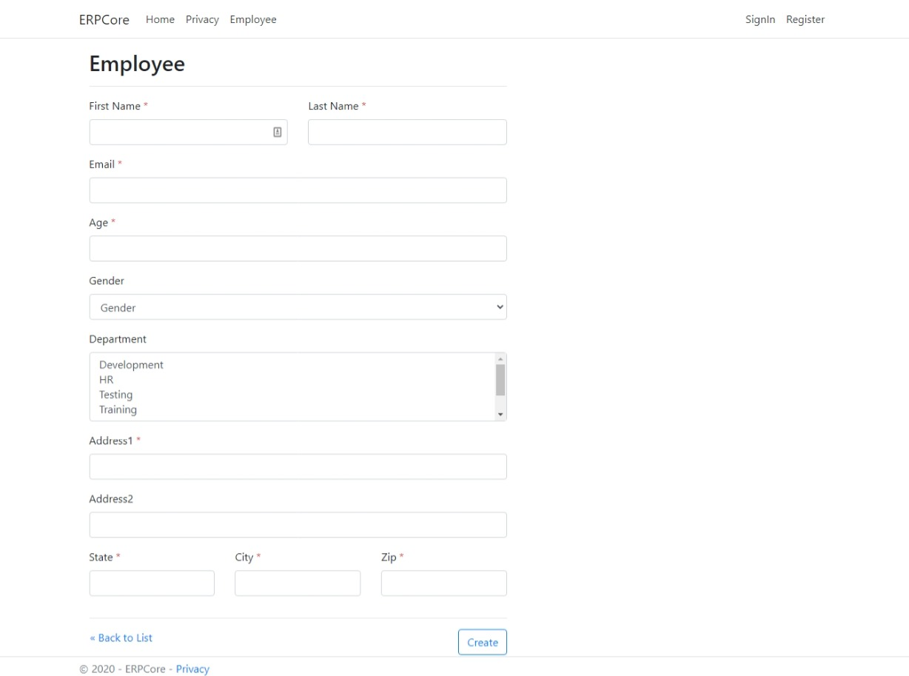
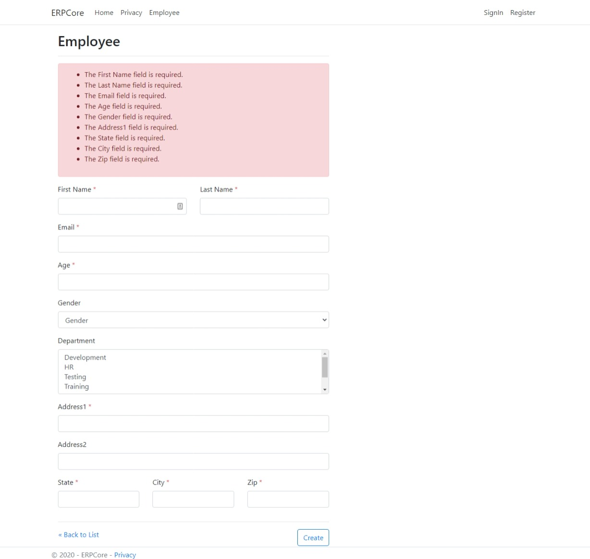
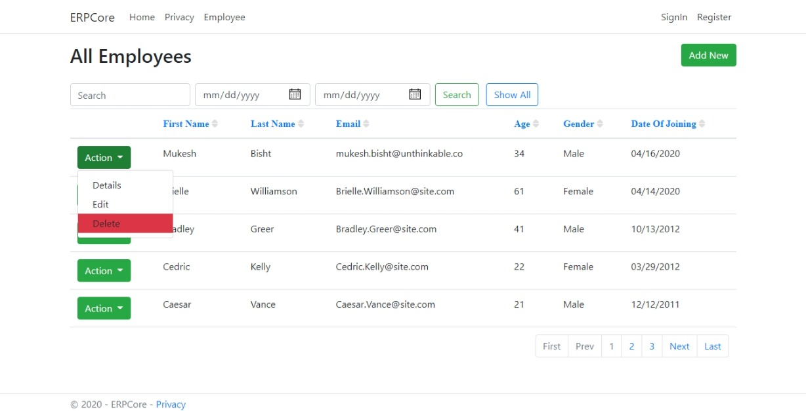
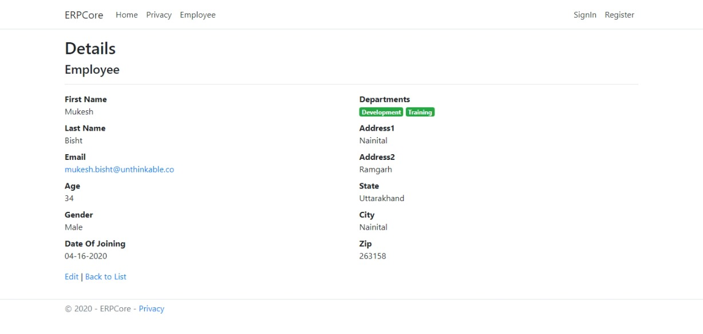
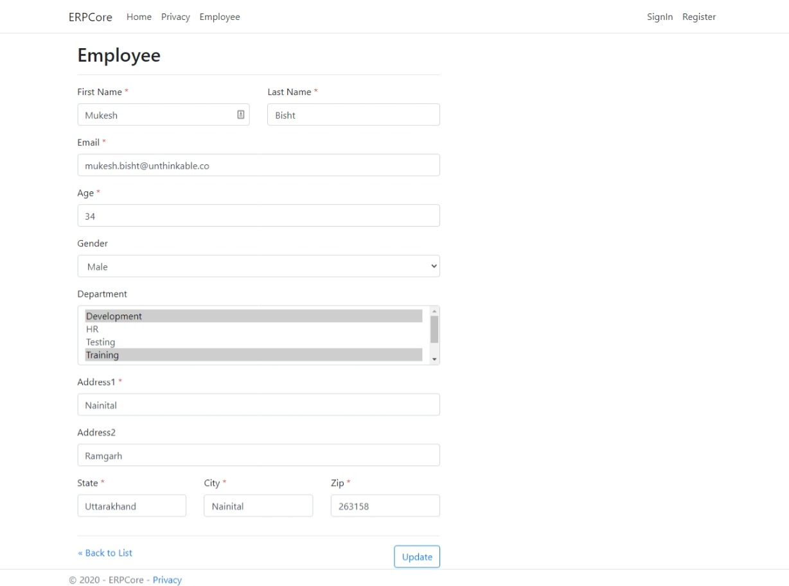
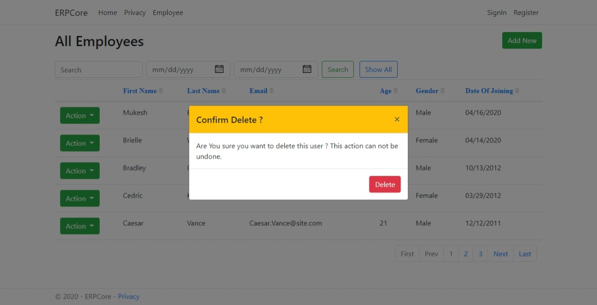
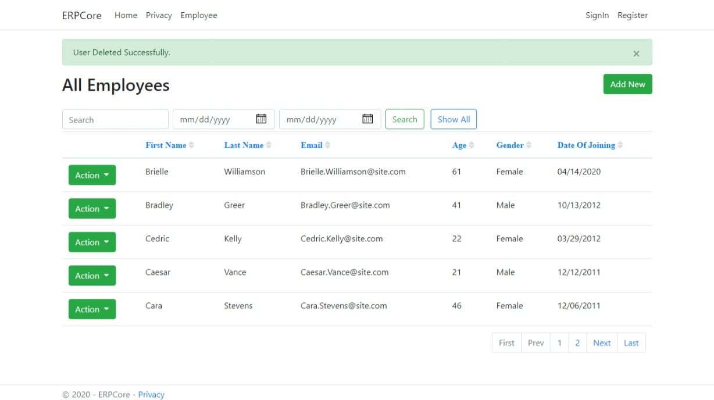

# ERPCore

## .netCore 3 POC

## Highlights

* CRUD
* Custom Tags (Pagination Tag)
* Entity Framework
* DI
* Razor pages

## Changing data store 
### Supported :
* In Memory
* SQLite
* MSSQL

```C#
   services.AddTransient<IEmployeeRepository, SqliteEmployeeRepository>();
   // services.AddTransient<IEmployeeRepository, MSqlEmployeeRepository>();
   // services.AddTransient<IEmployeeRepository, InMemoryEmployeeRepository>();
```

### Home Page
<kbd></kbd>

### Employee list Page
<kbd></kbd>

### Add Employee Page
<kbd></kbd>

### Add Employee Page : Validation
<kbd></kbd>

###  Employee list Page : Actions
<kbd></kbd>

###  Employee detail Page
<kbd></kbd>

###  Employee edit Page
<kbd></kbd>

###  Employee list Page : Delete
<kbd></kbd>

###  Employee list Page : Alert
<kbd></kbd>
